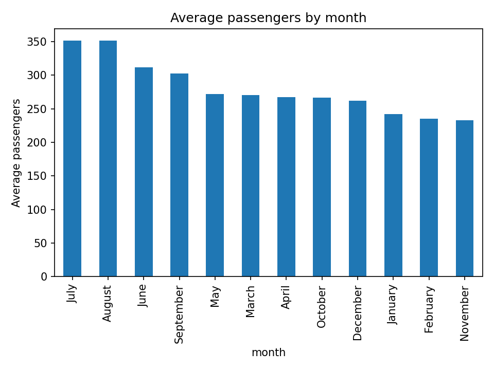
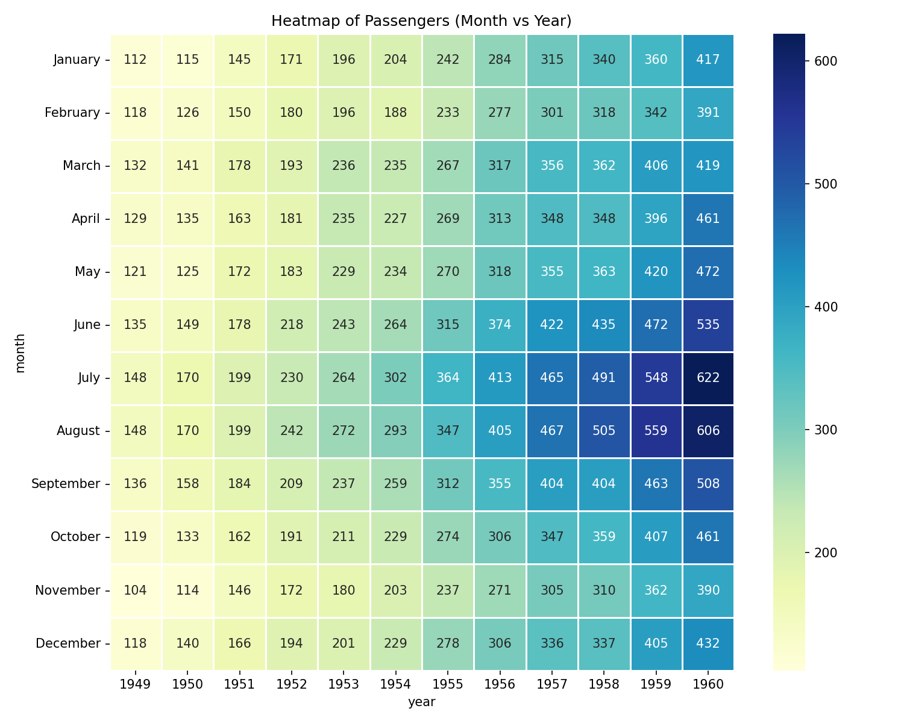

# Week 1 Python Git Lab 

## Dataset
> Flights  https://raw.githubusercontent.com/mwaskom/seaborn-data/master/flights.csv  
> Recommended columns: `month` (category), `passengers` (numeric)

## How to Run
Follow these steps to set up the environment and run the analysis.
```bash
python3 -m venv .venv
source .venv/bin/activate   # Windows: .\.venv\Scripts\Activate.ps1
pip install -r requirements.txt
python analyze.py
```

### What it does
- Loads a dataset directly from a URL using Python and Pandas.  
- Prints dataset summary (rows/cols, columns list, first 5 rows, grouped averages)
- Generates and overwrites  `output/barchart.png` , and `output/heatmap.png`

**Example output**
> Your script run should generate/overwrite `output/barchart.png` , and `output/heatmap.png`.



### Reflection
- What was the hardest part?
> Since the majority of the group members were familiar with the fundamentals of coding, creating the required outputs was not the difficult part. The challenging aspect was that one member's DATA100 instructor was different, which resulted in a minor difference in the repository they used. Additionally, when everyone in the group commits changes at the same time, working simultaneously inside the repository can be a little difficult. We specifically encountered issues with **merge conflicts** when editing the README simultaneously, which encouraged us to learn how to communicate before pushing code.
- What did you learn about Git commits (small commits, staging, meaningful messages)?
> We found that in order to prevent work overlap and unintentional changes, we must constantly communicate with one another as a group. Beyond communication, we learned that **small commits** are much safer than large ones; if a bug is introduced, it's easier to revert a small change than a massive one. We also appreciate the importance of **meaningful commit messages** (e.g., using "feat: add heatmap" instead of just "update"), which allowed our groupmates to understand the purpose of the new commit without needing to read the raw code.  

## Generative AI Disclosure (if applicable)
- Tool used:
  - Gemini AI
- What it was used for:
  - Sorting of the Heatmap Visualisation from alphabetical to the actual order of the months.

- What I personally verified/changed:
  - Changed the variable name to be uniform with the one I initially initialized.